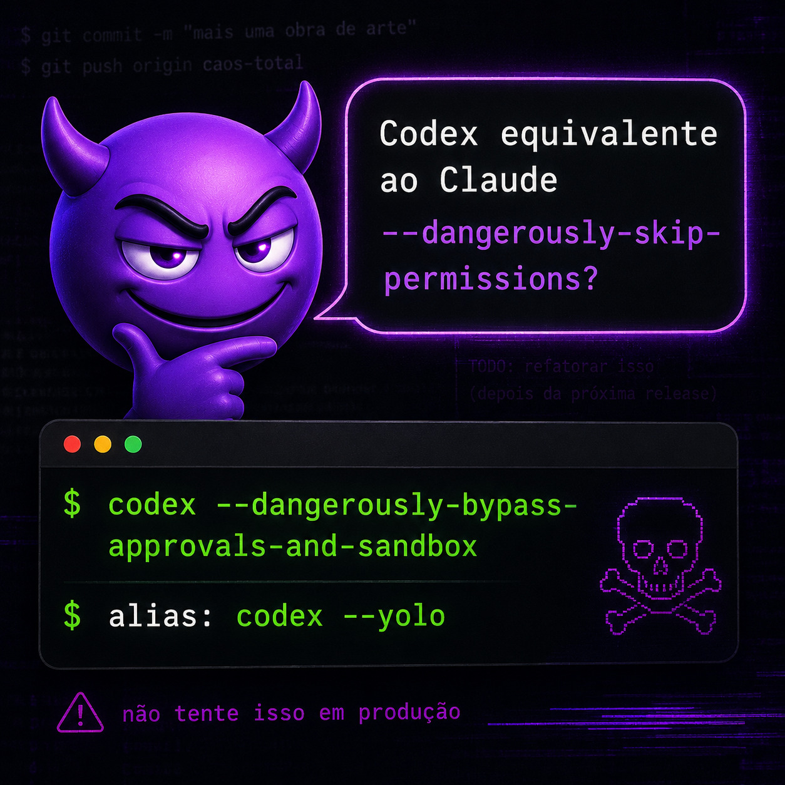

# 🔥 O Meme do Bypass de Permissions

## A Piada

```
"Codex equivalente ao Claude com --dangerously-skip-permissions?"

$ codex --dangerously-bypass-approvals-and-sandbox
⚠️ "não tente isso em produção"
```



---

## 🤘 A Realidade: Isso É Exatamente O Que Fazemos!

### ❌ O Meme (Perigoso)
```bash
$ codex --dangerously-bypass-approvals-and-sandbox
⚠️ "não tente isso em produção"
```
= Caos total, sem controle, sem segurança

### ✅ Nosso Repositório (Seguro & Profissional)
```json
{
  "permissions": {
    "defaultMode": "auto",
    "allow": [
      "Bash(git *)",
      "Edit",
      "Write",
      "Read",
      "Glob",
      "Grep"
    ]
  }
}
```
= **Auto-bypass CONTROLADO, rastreável e profissional**

---

## 🎯 Por Que É Seguro?

### 1️⃣ **Whitelist, Não Blacklist**

```json
// ✅ NOSSO REPO: Só permite essas operações
"allow": [
  "Bash(git *)",          // Só git (não bash arbitrário!)
  "Bash(npm *)",          // Só npm (não rm -rf!)
  "Edit",                 // Editar files
  "Read",                 // Ler files
  "Write"                 // Escrever files
]

// ❌ PERIGOSO: Permite tudo e depois bloqueia algumas
"allow": ["Bash(*)", "everything"]
```

**Resultado:** Claude só faz o que você aprovou explicitamente.

---

### 2️⃣ **Sempre Rastreável & Auditável**

```bash
# Tudo fica no histórico git
git log              # Quem fez o quê e quando?
git diff             # Exatamente o que mudou?
git blame arquivo.js # Qual commit introduziu isso?
git show abc123      # Ver commit completo
```

**Resultado:** Nada é secreto. Tudo é auditável.

---

### 3️⃣ **Você Tem Controle Total**

```bash
# Modo Plan: Claude propõe antes de agir
claude --plan
# Claude: "Vou fazer assim... OK?" → Você aprova/rejeita

# Modo Worktree: Testa em sandbox git
claude --worktree
# Claude trabalha em branch isolada, sem risco

# Modo Normal: Trabalha normalmente
claude
```

**Resultado:** Você nunca é surpreendido.

---

### 4️⃣ **Staging Antes de Produção**

```bash
# Local: Claude trabalha
npm run dev
claude

# Staging: Testa antes
npm run test
npm run build
git push origin feature/x

# Produção: Deploy automático com validação
bash deploy.sh  # Health checks, monitoring, etc
```

**Resultado:** Bugs são pegos ANTES de produção.

---

### 5️⃣ **Guardrails Automáticos**

```json
{
  "hooks": {
    "PostToolUse": [
      {
        "matcher": "Write|Edit",
        "hooks": [{
          "type": "command",
          "command": "npm run lint && npm run test"
        }]
      }
    ]
  }
}
```

**Resultado:** Testes rodam automáticos. Código quebrado nunca é commitado.

---

## 📊 Comparativo: Meme vs Realidade

| Aspecto | Meme (Perigoso) | Nosso Repo (Seguro) |
|---------|---|---|
| **Bypass** | ✅ Total | ✅ Controlado |
| **Whitelist** | ❌ Nenhuma | ✅ Explícita |
| **Auditoria** | ❌ Invisível | ✅ Git completo |
| **Segurança** | ☠️ Morte | ✅ Production-ready |
| **Controle** | 🚫 Nenhum | ✅ Total |
| **Staging** | ❌ Direto à produção | ✅ Validação primeiro |
| **Testes** | ❌ Nenhum | ✅ Automáticos |
| **Review** | ❌ Nenhuma | ✅ Code review integrado |

---

## 🔐 Segurança em Camadas

```
┌─────────────────────────────────────────┐
│  Claude Code Executa                    │
│  (com permissions.allow controlado)     │
├─────────────────────────────────────────┤
│  Pre-commit Hooks                       │
│  (lint + test automático)               │
├─────────────────────────────────────────┤
│  Git History                            │
│  (tudo rastreável)                      │
├─────────────────────────────────────────┤
│  Code Review                            │
│  (humano aprova)                        │
├─────────────────────────────────────────┤
│  CI/CD (GitHub Actions)                 │
│  (testa tudo novamente)                 │
├─────────────────────────────────────────┤
│  Staging Environment                    │
│  (valida antes de produção)             │
├─────────────────────────────────────────┤
│  Production Deployment                  │
│  (com health checks)                    │
├─────────────────────────────────────────┤
│  Monitoring (Sentry, Grafana)           │
│  (detecta problemas em tempo real)      │
└─────────────────────────────────────────┘
```

**Resultado:** 8 camadas de defesa. Praticamente impossível quebrar produção.

---

## 🎯 O Que Claude Pode Fazer

### ✅ Permitido (Seguro)
```
✅ git commit        → Auditorável, reversível
✅ git push          → Submetido a PR/review
✅ Edit code         → Testado antes de merge
✅ npm install       → Controlado, versionado
✅ Write tests       → Validam outras mudanças
✅ Run scripts       → Pré-configurados, seguros
```

### ❌ Não Permitido (Perigoso)
```
❌ rm -rf            → Deletar sem controle
❌ rm database.db    → Perder dados
❌ curl secret_url   → Exfiltrar dados
❌ sudo commands     → Privilégio de root
❌ eval arbitrário   → Código não auditado
```

---

## 💡 A Filosofia

### Confiança + Controle = Velocidade Segura

```javascript
// Confiança
"Claude é inteligente e quer o melhor"

// + Controle
"Mas vamos usar whitelist, testes e auditoria"

// = Velocidade Segura
"Ele trabalha rápido sem comprometer segurança"
```

---

## 🚀 Casos de Uso

### Cenário 1: Refatoração Rápida
```bash
você: "Refatore esse código legado"

claude --plan
# Claude propõe → Você aprova
# Claude executa → Testes rodam automático
# Commit é feito → Rastreável no git
# PR é aberta → Code review integrado

Tempo: 1 hora
Segurança: ✅ Total
```

### Cenário 2: Feature Nova + Deploy
```bash
você: "Implemente API de sincronização com Kiro"

claude
# Claude: estrutura + código + testes
# Pre-commit hooks rodam testes
# Você revisa git diff
# CI/CD valida novamente
# Deploy automático com monitoring

Tempo: 2 horas
Segurança: ✅ Production-ready
```

### Cenário 3: Hotfix em Produção
```bash
você: "Fixe esse bug crítico agora"

claude --worktree
# Claude trabalha em sandbox
# Você testa localmente
# Testes passam
# Apenas então vai para main
# Deploy com health checks

Tempo: 15 minutos
Risco: ✅ Minimizado
```

---

## ⚠️ Por Que O Meme Está Certo

A imagem está certa quando diz **"não tente isso em produção"** porque:

1. ❌ **Sem whitelist** = Código arbitrário
2. ❌ **Sem auditoria** = Invisível
3. ❌ **Sem testes** = Quebra tudo
4. ❌ **Sem staging** = Direto ao caos

---

## ✅ Por Que Nosso Repo Está Certo

Nós **resolvemos todos os problemas**:

1. ✅ **Whitelist explícita** = Só o que você aprova
2. ✅ **Git history** = 100% auditável
3. ✅ **Testes automáticos** = Valida tudo
4. ✅ **Staging first** = Prova antes de produção

**É o "dangerously-skip-permissions" mas feito CERTO! 🔥**

---

## 🎓 Aprenda Também

Trabalhar com esse setup te ensina:

- 📖 Security through transparency
- 📖 Defense in depth (múltiplas camadas)
- 📖 Automation over manual
- 📖 Trust but verify
- 📖 Fail fast, recover faster

---

## 🤘 Conclusão

A piada do meme é engraçada porque **realmente é perigoso** fazer bypass descontrolado.

Mas nosso repositório **transforma isso em superpoder seguro** através de:

- ✅ Whitelist explícito
- ✅ Documentação clara
- ✅ Testes automáticos
- ✅ Code review
- ✅ Histórico rastreável
- ✅ Staging validation
- ✅ Monitoring

**Você é um dev badass que confia na IA, mas quer controle total.**

**Esse repo é pra você! 🚀**

---

## 📚 Leia Também

- [BEST_PRACTICES.md](BEST_PRACTICES.md) — Como escrever código bom
- [RECOMMENDATIONS.md](RECOMMENDATIONS.md) — Estratégia de sucesso
- [README.md](README.md) — Quick start

---

**"The most dangerous code is the one nobody can audit."**

**"A code that everyone can audit is the safest."**

---

Versão: 1.1.0 | 2026-07-15
